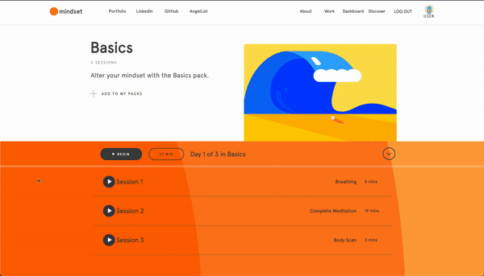
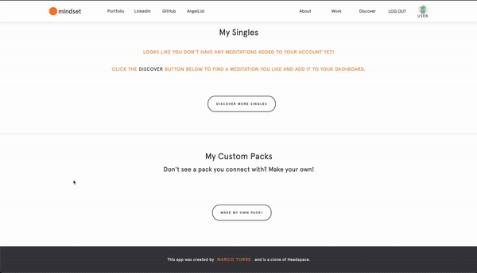

# [<p align="center"></p>][1]

Mindset is a single page web app and clone of [Headspace][7] - an application that provides an approachable, engaging, and enjoyable way to reap the benefits of meditation. This project was built from the ground up by [Marco Torre][2] using:
 
* Ruby on Rails
* Postgresql
* React
* Redux
* Javascript
* CSS/SASS

## <p align="center"> [Check Out the Live App!][1] </p>

## Meditation Player
The original Headspace app allows users to to listen to recorded meditations that belong 
to a series called a 'pack'. These themed packs guide listeners towards a more mindful approach to specific issues - better sleep, anxiety management, etc. To achieve this, I leveraged the HTML5 Audio Element's inbuilt functionality, React state management, and the visual versatility of CSS/SASS to create a dynamic, interactive, and visually engaging meditation player.

<p align="center"></p>

### Audio Player

Using the HTML `<audio>` element and React state management, I was able to store the track progress and display live track progress. I also used React's native event handlers like `onClick` and `onChange` to construct and style custom player controls. A point of pride is the progress bar which allows the listener to seamlessly scrub to any timestamp in the audio clip. A sample of the code can be seen below.

```js
//Saving the pertinent audio track information to state and binding respective helper functions
class Player extends React.Component {
    constructor(props) {
        super(props)
        this.state = {
            playing: false,
            currentTime: 0,
            duration: 0,
            completed: false
        }
        this.currentMed = this.props.currentMed
        this.audio = new Audio(this.props.currentMedUrl)
        this.handlePlay = this.handlePlay.bind(this)
        this.onScrub = this.onScrub.bind(this);
        this.onScrubEnd = this.onScrubEnd.bind(this);
        this.barClick = this.barClick.bind(this);
    }

//Adding and removing audio event listeners upon mounting or unmounting the component to avoid memory leaks
    componentDidMount() {
        this.audio.addEventListener("timeupdate", e => {
            this.setState({
                currentTime: e.target.currentTime,
                duration: this.audio.duration
            });
        });
    }

    componentWillUnmount() {
        this.audio.removeEventListener("timeupdate", () => {})
        clearInterval(this.trackTime)
        this.audio.pause()
    }
//Tracking and storing the track time in state
    startTimer() {
        if (this.trackTime) {
            clearInterval(this.trackTime)
        }

        this.trackTime = setInterval(() => {
            if (this.audio.ended) {
                return this.setState({ completed: true })
            } else {
                return this.setState({ currentTime: this.audio.currentTime })
            }
        }, [1000]);
    }
//Adding custom play/pause functionality so it can be added to custom player elements
    handlePlay() {
        if (!this.state.playing) {
            this.audio.play()
            this.setState({ playing: true })
        } else {
            clearInterval(this.trackTime)
            this.audio.pause()
            this.setState({ playing: false })
        }
        this.startTimer()
    }
//Creating scrub functions to track the user's interaction with the progress bar and update the track time 
    onScrub(value) {
        clearInterval(this.trackTime)
        if (this.state.playing) {
            this.audio.pause()
            this.setState({playing: false})
        } 
        this.setState({
            currentTime: value,
        })
    }

    onScrubEnd() {
        if (!this.state.playing) {
            this.audio.currentTime = this.state.currentTime
            this.setState({seeking:false})
        }
        this.handlePlay()
    }
//Formatting the track time to display clearly to the user
    formatTime(seconds) {
        return (
            [
                Math.floor(seconds / 60),
                Math.floor(seconds % 60),
            ].map(digit => digit.toString())
                .map(digit => (digit.length === 1 ? `0${digit}` : digit)).join(':')
        )
    }
//using React's native event handlers on the custom progress bar element
<input 
    type='range' 
    value={this.state.currentTime}
    min="0"
    max={this.state.duration}
    step="1"
    onMouseDown={() => {this.audio.play(); 
    this.audio.pause()}}
    onChange={(e) => this.onScrub(e.target.value)}
    onMouseUp={this.onScrubEnd}
    ref={progressBar => {this.progressBar = progressBar}}
    className='progress-bar'/>

```

### Pack Page & Animated Footer

Taking further advantage of React's native functionality, I utilized references to sub in for traditional vanilla DOM manipulation and create a responsive footer bar that houses the pack page meditation list UI.

## Custom User Packs

Since the parts of Headspace I was cloning didn't take advantage of full CRUD functionality, I decided to add my own. To create a simple interface in which to build your own pack, I built a modal component that, in conjuction with the intuitive MVC framework of Rails, allows a user to create their own custom meditation pack that they can add or remove specific meditations from.


<p align="center"></p>

## Discover Page with Filter Search

I visually modeled my Discover page after Headspace's own. However, I found their search function to be a bit slow. Using React references again allowed me to quickly show the user exactly what they wanted when they wanted. Dynamically mapping references onto their corresponding list elements let me pre-populate the page with packs and meditations and show or hide content based on the user's search criteria.

```js
//Dynamically mapping the references to their specified elements
<ul className='list'>
    {genres.map((genre, i) => (
        <div className='list'
            key={`${genre}-${Math.random() * i}`}>
            <li className={`${genre} nav-genres`}
                ref={ref => (this.genreRefs.push(ref))}
                onClick={(e) => { this.removeNull();this.filter(e)}}>
                {`${genre}`}
            </li>
        </div>
    ))}
</ul>
```

```js
//Creating a filter function to make use of the references in the search
filter(e) {
        this.removeNull()
        let genreClass = e.target.classList[0]
        let oldSingles = this.allSinglesRef.current
        let oldPacks = this.allPacksRef.current
        if (oldPacks.classList[1] === 'hideme') {
            oldPacks.className = `${oldPacks.classList[0]} showme`
        }
        oldSingles.className = `${oldSingles.classList[0]} hideme`

        this.packRefs.forEach(pack => {
            if (genreClass === pack.classList[0]) {
                pack.className = `${pack.classList[0]} showme`
            } else {
                pack.className = `${pack.classList[0]} hideme`
            }
        })
    }
```

# Creator 

##  
## **Marco Torre** 
[][3] 
[][4] 
[][5] 
[][6]

Marco is originally from New Orleans and studied performing arts at NYU and later got his masters from conservatory in London. His passion for creating exciting and engaging things inspired him to become a software engineer. He loves taking a creative approach to problem solving and writing clean, concise code to build applications that inspire and 


[1]: https://mind-set.herokuapp.com/#/
[2]: https://www.marcotorre.io/#

[3]: https://www.linkedin.com/in/marco-torre-388286138/
[4]: https://github.com/OcramT
[5]: https://angel.co/u/marco-torre-1
[6]: https://www.marcotorre.io/

[7]: https://www.headspace.com
